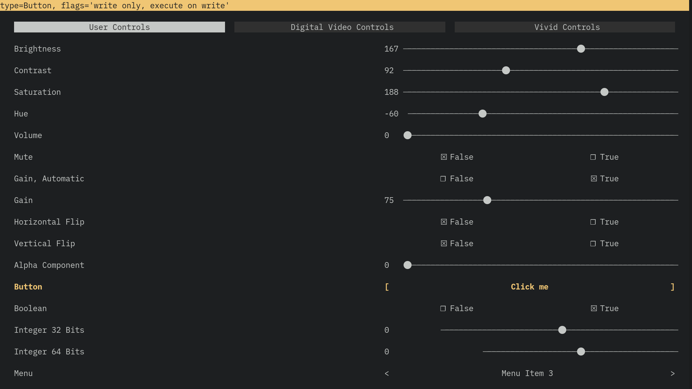

# pyVidController

A small python utility for controlling video4linux cameras.
It queries user-controls from the v4l2 devices and creates a TUI to display and adjust their values.

Features vi-like keybindings.

## Keybindings

| Key | Function                       |
|-----|--------------------------------|
| q   | exit                           |
| j   | next entry                     |
| k   | previous entry                 |
| h   | decrease current value by 1%   |
| H   | decrease current value by 10%  |
| u   | decrease current value by 0.1% |
| U   | decrease current value by 0.5% |
| l   | increase current value by 1%   |
| L   | increase current value by 10%  |
| p   | increase current value by 0.1% |
| P   | increase current value by 0.5% |

